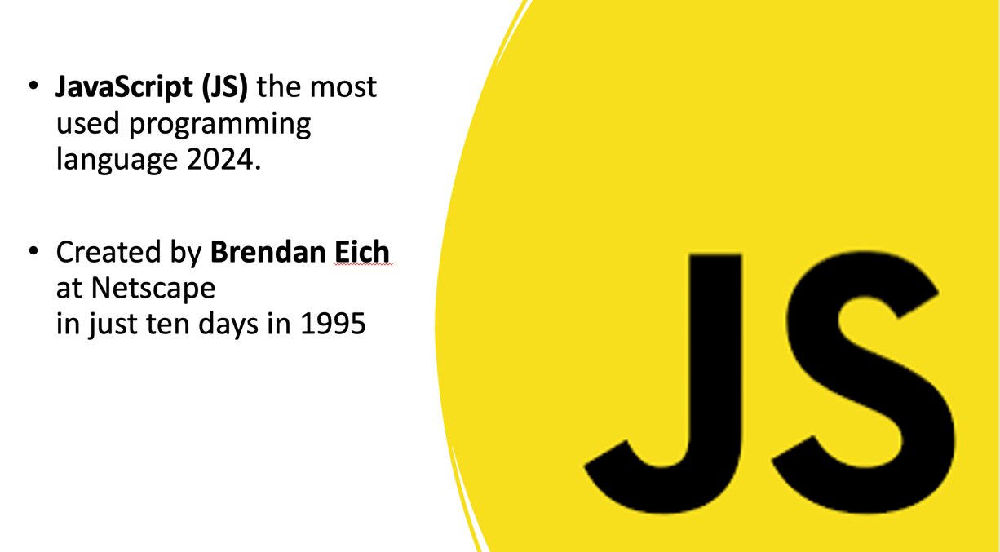
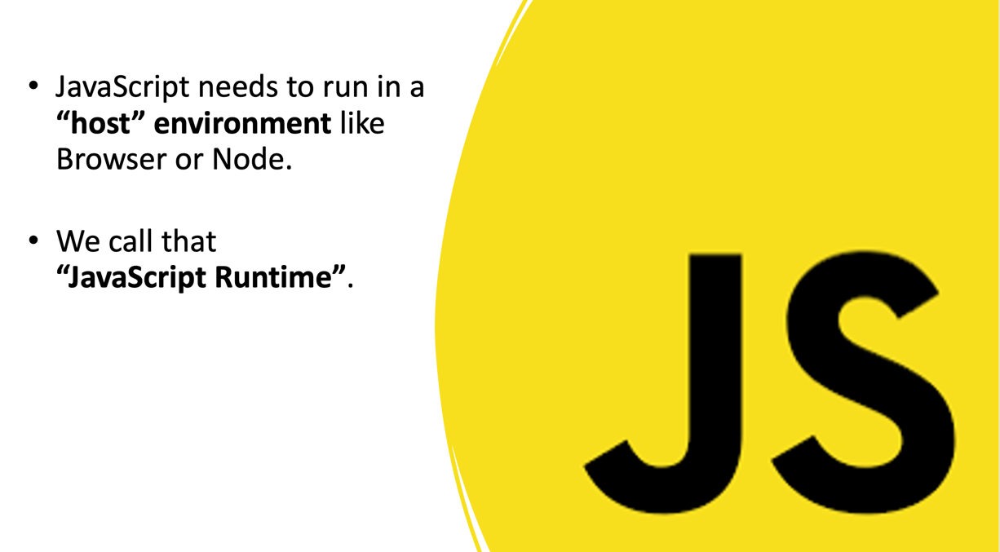
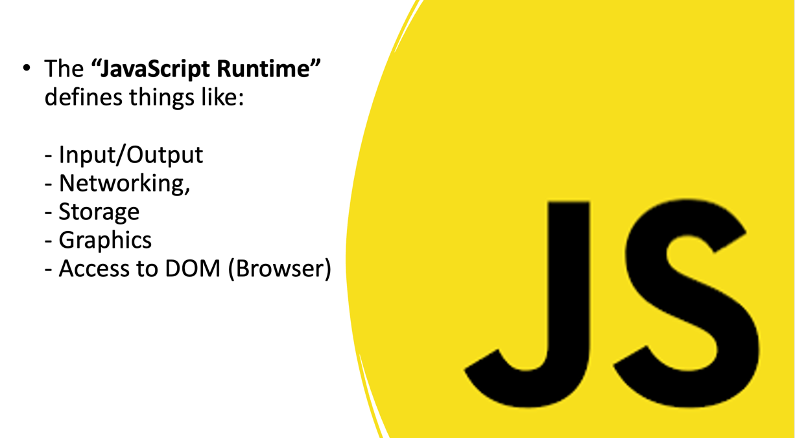
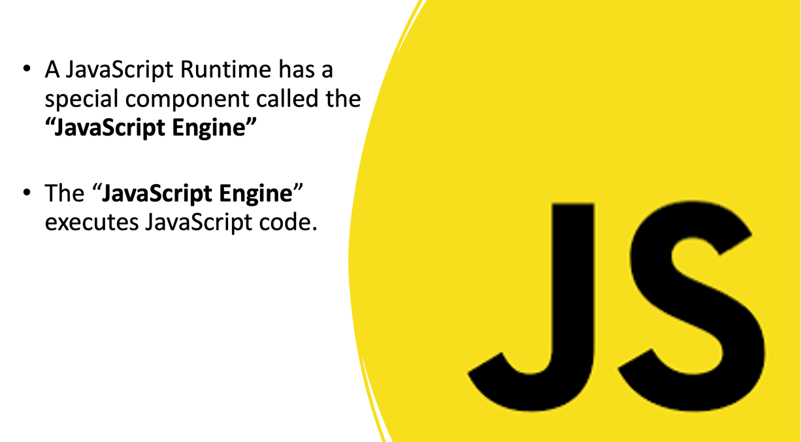
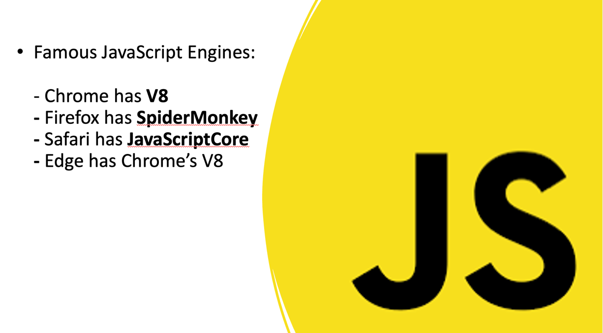
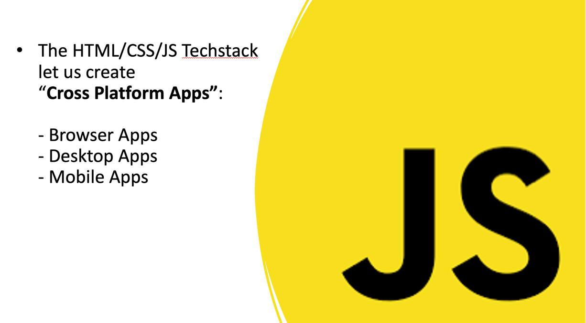
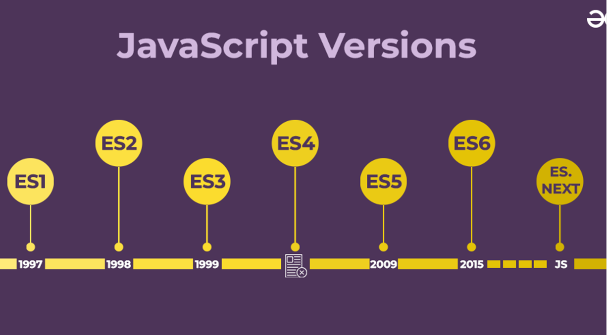
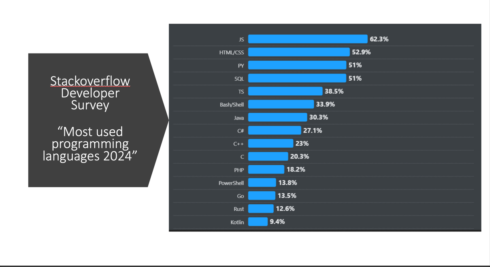
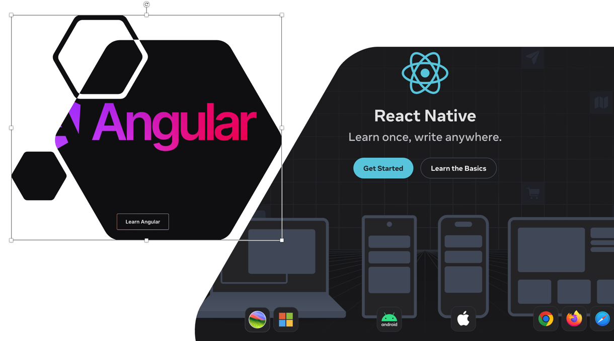

# 1. JavaScript

# 2. Host Environment

# 3. JavaScript Runtime

# 4. JavaScript Engine

# 5. Famous JavaScript Engines

# 6. JavaScript Cross-Platform

# 7. JavaScript Versions

# 8. Programming Languages

# 9. JavaScript Frameworks

