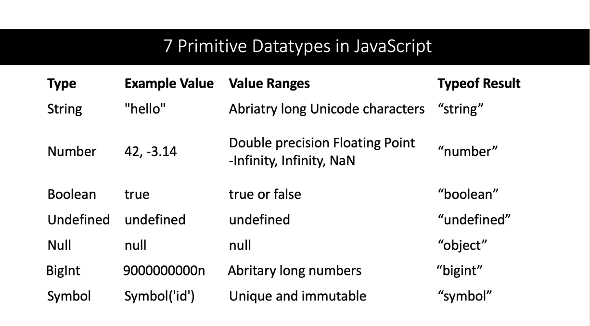

# JavaScript Language Overview


## 1. Introduction

### Overview
* **Link**: https://developer.mozilla.org/en-US/docs/Web/JavaScript
* **Purpose**: A dynamic, multi-paradigm programming language primarily used for web/mobile development.
* **Developed By**: Brendan Eich at Netscape in 1995

### Key Features
* **Interpreted Language**: Executes code line by line without a compilation step.
* **Dynamic Typed**: Variables types can change during runtime.
* **Weakly Typed**: Allows implicit type conversion between different data types.


### Use Cases
* **Frontend Development**: Building interactive web apps using e.g. React, Angular, or Vue.
* **Backend Development**: Building server-side applications using e.g. Node.js.
* **Mobile Development**: Building cross-platform mobile applications using e.g. React Native.

## 2. Programming Languages 2024

Developer Survey [Stack Overflow](https://survey.stackoverflow.co/2024/?utm_source=iterable&utm_medium=email&utm_campaign=dev-survey-2024&utm_content=take-the-survey)  

  


## 3. Basics

### Hello, World!

- **Console**: A built-in object that provides access to the console.

```javascript
console.log("Hello, World!");
```

- **Alert (browser only)**: A built-in function that displays a message box `in the browser`.

```javascript
alert("Hello, World!");
```

- **Prompt (browser only)**: A built-in function that displays a dialog box for user input `in the browser`.
```javascript
const name = prompt("Enter your name:");
alert("Hello, " + name);
```

### Variables

In JavaScript, variables are declared using `let` and `const`.


- **let**: Mutable variable that can be reassigned.

```javascript
let name = "Alice";
name = "Bob";  // ✅ OK: Reassigning the variable
```

- **const**: Immutable variable that cannot be reassigned.

```javascript
const pi = 3.14;
pi = 3.14159;  // ❌ Error: Assignment to constant variable
```

### Data Types

In JavaScript, there exists two types of data types: `Primitive` and `Objects`.

- **Primitives**: e.g. `string`

```javascript
const name = "Alice";
```

- **Objects**: Complex data structures e.g. `arrays`, `functions`, `objects`

```javascript
const person = { name: "Alice" };
```

- **typeof**: Returns the type of a variable as a `string`.

```javascript
const name = "Alice";
typeof name;  // "string"

const person = { name: "Alice" };
typeof person;  // "object"
```

### Primitives

In JavaScript, `primitive` data types are immutable in the sense that they cannot be changed. e.g. `42` is always `42`.


- **Number**: Numeric data type (e.g. integers, floats)
```javascript
const number = 42;                  // 42
typeof number;                      // "number"

const pi = 3.14;                    // 3.14
typeof pi;                          // "number"
```

- **String**: Textual data type (e.g. characters, words)
```javascript
const name = "Rene";                // "Rene"
typeof name;                        // "string"
```

- **Boolean**: Logical data type (e.g. true or false)
```javascript
const turnedOn = true;              // true
typeof turnedOn;                    // "boolean"
```

- **Undefined**: Represents an uninitialized value, e.g. a variable that has not been assigned a value.
```javascript
let value;                          // undefined
typeof value;                       // "undefined"
```

- **Null**: Represents an intentional absence of any value.
```javascript
let empty = null;                   // null
typeof empty;                       // "object"
```

### Strings

In JavaScript, `strings` are used to store and manipulate text which can be any character in the Unicode character set.

- **Unicode**: A standard for encoding, representing, and handling text in any language in the world.

```javascript
const emoji = "🚀";                  // "🚀"
const chinese = "你好";               // "Hallo"
```

- **Create a String**: Using `""` or `''`.

```javascript
const name = "Alice";
const message = 'Hello, World!';
```

- **Length**: The length property returns the number of characters.

```javascript
const name = "Alice";
name.length;  // 5
```

- **Concatenation**: Combining strings using the `+` operator.

```javascript
const greeting = "Hello, " + name;
```

- **Template Literals**: Using backticks to create strings with placeholders `${}`.

```javascript
const name = "Alice";
const greeting = `Hello, ${name}`;
```

### Operators

In JavaScript, `operators` are used to perform operations on variables and values.

- **Arithmetic Operators**: `+`, `-`, `*`, `/`

```javascript
const sum = 10 + 5;                 // 15
const difference = 10 - 5;          // 5
const product = 10 * 5;             // 50
const quotient = 10 / 5;            // 2
```

- **Assignment Operators**: `=`, `+=`, `-=`, `*=`, `/=`

```javascript
const number = 10;
number += 5;                        // number = number + 5
```

- **Logical Operators**: `&&`, `||`, `!`

```javascript
false || true;                      // true
```

- **Loose vs Strict Equality**: `==`, `===`

In JavaScript, to compare values by using `===` (strict equality) and `==` (loose equality).

```javascript
10 == 10;                           // true (loose equality)
10 == "10";                         // true (loose equality)
10 === "10";                        // false (strict equality)
```

### Type Coercion

In JavaScript, `type coercion` is the automatic conversion of values from one data type to another.

- **String Context**: Converts a `value` to a `string`.

```javascript
const string1 = 42+"";              // "42"
const number2 = (42+"42") + 2       // "42422"
```

- **Number Context**: Converts a `value` to a `number`.

```javascript
const number1 = +"42"               // 42
const number2 = (42+"42") - "2"     // 4240
```

- **Boolean Context**: Converts a `value` to a `boolean`.

In JavaScript, certain values are `falsy` and `truthy`. [Full Explanation](#truthy-and-falsy).

```javascript
const boolean1 = !!"";              // Converts to false
const boolean2 = !!"Hello"          // Converts to true
```

### Type Conversion

In JavaScript, `type conversion` is the explicit conversion of a value from one data type to another.

- **String Fn**: Converts a `number` to a `string`.

```javascript
const string = String(42);          // "42"
typeof string;                      // "string"
```

- **Number Fn**: Converts an integer-based `string` to a `number`.

*Not forgiving*: If the string is not a valid integer, it returns `NaN`.

```javascript
const number = Number("42");        // 42
typeof number;                      // "number"

const pixel = Number("42px");       // NaN
typeof pixel;                       // "number"
```

- **parseInt Fn**: Converts an integer-based `string` to a `number`.

*Forgiving*: If the string is not a valid integer, it returns the `integer part`.

```javascript
const number = parseInt("42");      // 42
typeof number;                      // "number"

const pixel = parseInt("42px");     // 42
typeof pixel;                       // "number"
```

- **Boolean Fn**: Converts a `value` to a `boolean`.

In JavaScript, certain values are `falsy` and `truthy`. [Full Explanation](#truthy-and-falsy).

```javascript
const boolean = Boolean(42);        // true
typeof boolean;                     // "boolean"
```

### Not a Number (NaN)

In JavaScript, `NaN` is a special number produced when a `mathematical operation` fails.

- **NaN**: is technically a `number`.

```javascript
typeof NaN;                         // "number"
```

- **Check for NaN**: Using the `isNaN` function.

```javascript
Number.isNaN(NaN);                  // true
Number.isNaN(10);                   // false
```

- **Division by Zero**: Dividing a number by zero results in `NaN`.

```javascript
const result = 10 / "apple";        // NaN
Number.isNaN(result);               // true
```
- **Converting not a Number**: Converting an invalid number results in `NaN`.

```JavaScript
const result = Number('42px');      // NaN
Number.isNaN(result);               // true
```

### Conditional Statements

In JavaScript, `conditional statements` are used to perform different actions based on different conditions.

- **If Statement**:

Executes a block of code if the condition is `true`. Otherwise, it skips the block.

```javascript
// Check if age is greater or equal to 18
if (age >= 18) {
    console.log("You are an adult");
}
```

- **If-Else Statement**:

Executes a block of code if the condition is `true`, otherwise executes another block of code.

```javascript
// Prompt the user for their age
const ageFromUser = prompt("Enter your age:");

// Convert the age to a number
const age = Number(ageFromUser);

// Check if age is greater or equal to 18
if (age >= 18) {
    console.log("You are an adult");
} else {
    console.log("You are a minor");
}
```

### Iteration Statements

In JavaScript, `iteration statements` are used to execute a block of code multiple times.

- **For-Statement**:

Call a block of code multiple times. `for (initialization; condition; increment) { ... }`

```javascript
// Loop from 0 to 4
for (let i = 0; i < 5; i++) {
    console.log(i);
}
```

### Functions

In JavaScript, `functions` are used to perform a specific task or calculate a value.

- **Create a Function**: Using the `function` keyword. `function name() { ... }`

```javascript
function greet() {
    console.log("Hello, World!");
}

typeof greet; // "function"
```

- **with Parameters**: A function that accepts `parameters`.

```javascript
function greet(name) {
    console.log("Hello, " + name);
}
```

- **with Return Value**: A function that returns a value using the `return` keyword.

```javascript
function add(num1, num2) {
    return num1 + num2;
}
```

### Objects

In JavaScript, `objects` are used to store an `unordered collection` of data as `properties`.

- **Create an Object**: Using `{}` and defining its properties by `key: value` pairs.

```javascript
const person = { name: "Ana", age: 18 };
typeof person;  // "object"
```

- **Number of Properties**: The `Object.keys` with `length` returns the number of properties.

```javascript
Object.keys(person).length;  // 2
```

- **Accessing Properties**: Using the `.` operator.

```javascript
person.name;  // "Ana"
```

- **Updating Properties**: Using the `=` operator.

```javascript
person.name = "Susi";
```

- **Iterating over Properties**: Using a `for-in` loop.

The `for-in` loop gives us each `key` one by one, but not necessarily in the order they were added (hence `unordered collection`).

https://stackoverflow.com/questions/280713/elements-order-in-a-for-in-loop

```javascript
// Loop over all `keys` in the object
for (let key in person) {
    value = person[key];
    console.log(key, value);
}
```

### Arrays

In JavaScript, `arrays` are used to store an `ordered collection` of data called `elements`.

- **Create an Array**: Using `[]` and a list of elements.

```javascript
const fruits = ["Apple", "Banana", "Cherry"];
typeof fruits;  // "object"
```

- **Number of Elements**: The length property returns the number of elements.

```javascript
fruits.length;  // 3
```

- **Accessing Elements**: Using the `Bracket Notation` `[]` and the index.

```javascript
fruits[0];  // Access the first element, "Apple"
```

- **Updating Elements**: Using the `Bracket Notation` `[]` and the index.

```javascript
fruits[0] = "Orange";  // Update the first element, to "Orange"
```

- **Iterating over Elements**: Using a `for-of` loop.

The `for-of` loop gives us each element one by one, in the order they were added (hence `ordered collection`).

```javascript
// Loop over all `elements` in the array
for (let fruit of fruits) {
    console.log(fruit);
}
```


## 4. Intermediate

### Truthy and Falsy

In JavaScript, if a `value` is used in a `Boolean Context`, it is coerced to a `boolean`, thereby becoming `truthy` or `falsy`.


- **Boolean Context**: Using `if`, `while`, `for`, `&&`, `||`, `!`.

```javascript
// Using the `if` statement to check if a value is `truthy`
if (value) { /* .. */ }

// Using the `||` operator as a default value guard
const defaultValue = value || "default";
```

- **Falsy Values**: `false`, `0`, `""`, `null`, `undefined`, `NaN`

https://developer.mozilla.org/en-US/docs/Glossary/Falsy

```javascript
Boolean(0);                 // false
Boolean("");                // false
```

- **Truthy Values**: all values that are not falsy.

```javascript
Boolean(42);                // true
Boolean("Hello");           // true
```

- **Coercion**: Using `!!` to convert a value to a boolean.

```javascript
!!"";                       // false
!![];                       // true
```

- **Check for Truthy**: Using if statement to check if a value is `truthy`.

```javascript
function greet(name) {
    // If name is truthy, use `name`.
    if (name) {
        return `Hello, ${name}`;
    // Otherwise, use "World".
    } else {
        return "Hello, World";
    }
}
```

- **Check for Falsy**: Using if statement to check if a value is `falsy`.

```javascript
function greet(name) {
    // If name is falsy, use "World".
    if (!name) {
        return "Hello, World";
    // Otherwise, use `name`.
    } else {
        return `Hello, ${name}`;
    }
}
```

- **Default Value**: Using the `||` operator as a `default value guard` to provide a default.

```javascript
function greet(name) {
    // If name is falsy, use "World" as the default value.
    name = name || "World";
    return `Hello, ${name}`;
}
```

### Nullish

In JavaScript, the `nullish` values are `null` and `undefined`.

- **`null` == `undefined`**:

```javascript
null == undefined;              // true (loose equality)
null === undefined;             // false (strict equality)
```

- **Nullish vs Falsy**:

```javascript
if (value == null) {
    // value is `null` or `undefined`
}

if (!value) {
    // value is `false`, `0`, `""`, `null`, `undefined`, `NaN`
}
```

### Objects

In JavaScript, `objects` are used to store an `unordered collection` of data called `properties`.

- **Key-Value Pairs**:

Properties consist of key-value pairs. Keys are `strings` and values can be any data type (e.g. `string`, `number`, `boolean` or `object`).

```javascript
const person = { name: "Ana", age: 18 };
```

- **Accessing Properties**:

Properties can be accessed using the `Dot Notation` `.` or the `Bracket Notation` `[]`.

```javascript
student.name;                   // Dot Notation
student["name"];                // Bracket Notation
```

- **Accessing Properties with Dynamic Keys**:

Properties can be accessed using a variable with the `Bracket Notation` `[]`.

```javascript
const property = "name";        // `Dynamic key`
student[property];              // Bracket Notation with `Dynamic Key`
```

- **Accessing non-existing Properties**:

Accessing a non-existing property returns `undefined`.

```javascript
student.city;                   // ❌ undefined
```

- **Updating Properties**:

Properties can be updated using the `Dot Notation` `.` or the `Bracket Notation` `[]`.

```javascript
student.name = "Bob";
student["name"] = "Bob";
```

- **Adding Properties**:

Properties can be added to an object using the `Dot Notation` `.` or the `Bracket Notation` `[]`.

```javascript
student.city = "New York";
student["city"] = "New York";
```

- **Deleting Properties**:

Properties can be deleted using the `delete` operator.

```javascript
delete student.name;
```

### Object Methods

- **Methods**:

Objects can have properties that are functions, called `methods`. The methods can access the object using `this`.

```javascript
const student = {
    // Properties with primitive values
    name: "Ana",
    age: 18,
    
    // Property is a function (aka method)
    greet: function() {
        // `this` refers to the object
        return `Hello, ${this.name}`;
    },
};
```

- **Calling Methods**:

Accessing a property and calling it with `()` executes the function (aka method).

```javascript
student.greet();                 // "Hello, Ana"
```


- **Calling non-existing Methods**:

Accessing a non-existing property and calling it with `()` results in an error.

```javascript
student.walk                     // undefined
student.walk();                  // ❌ Error: student.walk is not a function
```

### Object Nesting

- **Key-Value Pairs**:

Properties consist of key-value pairs. Keys are `strings` and values can be any data type even another `object`.

```javascript
const person = {
    // Properties with primitive values
    name: "Ana",
    age: 18,

    // Property is an object
    address: {
        city: "New York",
        zip: 10001,
    },
};
```

- **Accessing Nested Properties**:

Using the `Dot Notation` `.` or the `Bracket Notation` `[]`.

```javascript
person.address.city;                // "New York"
person["address"]["city"];
```