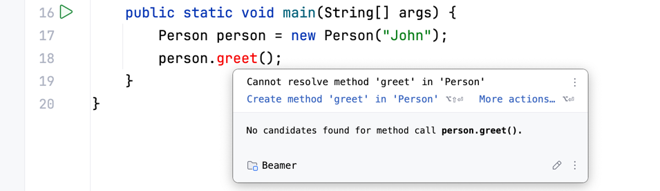
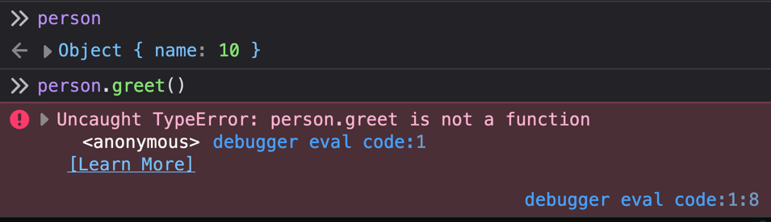

# Java vs JavaScript


## 1. Overview

- **Compiler**: Translates the code into `machine code` or `bytecode` before execution.
- **Interpreter**: Translates and executes the code line by line during `runtime`.
- **Java**: Compiled language that uses `JVM` to execute the `bytecode`.
- **JavaScript**: Interpreted language that uses `JavaScript runtime` to execute the code.
- **JIT Compilation**: Both languages use `JIT` (Just-in-Time) compilation to optimize frequently executed code.
- **Errors**: Java detects errors during `compilation` while JavaScript detects errors during `runtime`.

## 2. Execution Process

### Java

- **1. Compilation**: Java code is first compiled into `bytecode` by the `javac` compiler.
- **2. Execution**: The `JVM` interprets the `bytecode` and runs the code on the machine.
- **3. Optimization**: The `JVM` uses `JIT compilation` to convert frequently executed code into `machine code` for performance.

### JavaScript

- **1. Execution**: JavaScript is `parsed`, `compiled` into bytecode, and executed by the `JavaScript engine` e.g. `V8 Engine` in the browser.
- **2. Optimization**: The `JavaScript runtime` uses `JIT compilation`  to convert frequently executed code into `machine code` for performance.


## 3. Compile vs Runtime Errors

### Java

- **Compiler**: The Java Compiler checks the code for `type errors` and `syntax errors` during development.
- **Errors during Compile-Time**: If there are any errors the code will not run and the `compile-time` errors will be shown.




### JavaScript

- **No Compiler**: There is no JavaScript Compiler that checks the code for `type errors` or `syntax errors` during development.
- **Errors during Runtime**: If there are any errors the code will still run but causes `runtime errors` and unexpected behavior.



## 4. Type System

### Java

- **Static Typed**: Java has a `static` and `strong type` system which means that variables have a fixed type and cannot change.

```java
String name = "John";

// Static Typing: ❌ Error: Variables cannot change types
name = 42;              

// Strong Typing: ❌ Error: No type conversion from boolean to int
int value = +true;
```

### JavaScript

- **Dynamic Typed**: JavaScript has a `dynamic` and `weak type` system which means that variables can change types and allow type conversion between different data types.

```javascript
let name = "John";
typeof name; // "string"

// Dynamic Typing: ✅ OK: Variables can change types
name = 42;
typeof name; // "number"

// Weak Typing: ✅ OK: type conversion from boolean to number
let value = +true; // 1
```

## 5. Classes and Objects

### Java Classes

- **Classes**: In Java we can define classes with `class` and place `attributes` and `methods` inside the class.
- **Encapsulation**: This encapsulates the `attributes` aka data `methods` aka behaviour inside the same class.
- **Instance**: Then we create `instances` aka objects with `new` and access it's public methods.

```java
public class Person {
    private String name;                    // Private Attribute
    
    public Person(String name) {            // Constructor
        setName(name);
    }
    
    public String getName() {               // Getter
        return name;
    }
    
    public void setName(String name) {      // Setter
        this.name = name;
    }
    
    public String greet() {                 // Method
        return "Hello, " + name;
    }
}
```

- **Usage**: After we instantiate an object and access its public methods.
```java
// 1. Create an object with `new`
Person person = new Person("Alice");

// 2. Use the object
person.setName("Bob");
String greetings = person.greet();
System.out.println(greetings); // "Hello, Bob"
```


### JavaScript Classes

- **Classes**: In JavaScript we can use classes like in Java.
- **Syntactic Sugar**: However, internally JavaScript uses `prototypes` to mimic classes hence it's just a syntactic sugar.

```javascript
class Person {
    #name;                              // Private Attribute (note the #)
    
    constructor(name) {                 // Constructor
        this.#name = name;
    }
    
    get name() {                         // Getter   
        return this.#name;
    }
    
    set name(name) {                     // Setter
        this.#name = name;
    }
    
    greet() {                            // Method
        return `Hello, ${this.#name}`;
    }
}
```

- **Usage**: After we instantiate an object and access it's public methods.
```javascript
// 1. Create an object with `new`
const person = new Person("Alice");

// 2. Use the object
person.name = "Bob";
const greetings = person.greet();
console.log(greetings); // "Hello, Bob"
```

### JavaScript Objects

- **Objects**: In JavaScript we often create `objects` with specific `properties` and their values directly.
- **Properties**: However, the properties are public and can be accessed directly.
- **Methods**: We can also add `methods` to the object to update or access the properties.

```javascript
const person = {
    name: "Alice",         // Property

    greet: function() {    // Method
        return "Hello, " + this.name;
    }
};
```

- **Usage**: After we just access the properties directly
```javascript
// 1. Create an object directly
// const person = { .. }

// 2. Use the object
person.name = "Bob";
const greetings = person.greet();
console.log(greetings); // "Hello, Bob"
```


