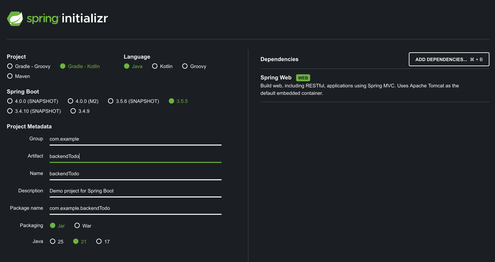
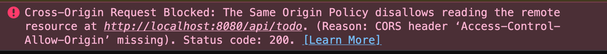
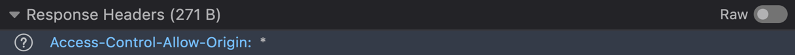

# Walkthrough: Minimal Client–Server (React / Spring Boot)

## 1. Introduction

### Goal

* Create a minimal Client (React) and Server (Spring Boot) app.

### Expected Outcome

* Two repos (`frontendTodo`, `backendTodo`)
* React Client (Frontend)
* Spring Boot Server (Backend)
* Understand API contracts (endpoint).
* Understand SOP/CORS.
* Share code via Git (GitHub).
* Use curl/Postman to test APIs.
* Share your local server with ngrok (public URL).

## 2. Prerequisites

**Tools needed**:

* **Node**
* **npm**
* **Java JDK 21+**
* **Git**
* **GitHub account**
* **curl** (Git Bash/macOS/Linux)
* **Postman** ([www.postman.com](http://www.postman.com))

**Verify**:

```sh
node -v                           # v18+
npm -v                            # v9+
java -version                     # 21+
curl --version                    # prints version
```

## 3. Walkthrough

### Step 1 — Initialize GitHub repositories

Go to GitHub and create two empty GitHub repos: `frontendTodo` and `backendTodo`.

* Clone both repos locally:

```sh
# clone the empty frontend repo
git clone https://github.com/<you>/frontendTodo.git

# clone the empty backend repo
git clone https://github.com/<you>/backendTodo.git
```

### Step 2 — Create Server (Java, Spring Boot)

Create a minimal Spring Boot Web project.

* Scaffold project via Spring Initializr (Option A):



```sh
cd backendTodo
unzip -o backendTodo.zip -d .
```

* Scaffold project via curl (Option B):

```sh
cd backendTodo
curl https://start.spring.io/starter.zip \
  -d type=gradle-project-kotlin \
  -d language=java \
  -d javaVersion=21 \
  -d groupId=com.example \
  -d artifactId=backendTodo \
  -d name=backendTodo \
  -d dependencies=web \
  -o backendTodo.zip
unzip -o backendTodo.zip -d .
```

* **Run Server:**

By default, Spring Boot runs on port `8080`. But you can specify a different port.

```sh
./gradlew bootRun                             # default port 8080
./gradlew bootRun --args='--server.port=5000' # specify port if needed
```

### Step 3 - API Contract

* Define an Web API Endpoint:

We create a simple API endpoint that returns a greeting.


  | **Description**   | **Protocol + Verb** | **Path**    | **Response**    |
  | ----------------- | ------------------- | ----------- |-----------------|
  | Return a greeting | HTTP GET            | `/api/todo` | `"Hello World"` |


* Add **Controller** `src/main/java/com/example/backendTodo/TodoController.java`:

A controller class handles incoming HTTP requests. Each method in the controller corresponds to an API endpoint.

```java
package com.example.backendTodo;

import org.springframework.web.bind.annotation.GetMapping;
import org.springframework.web.bind.annotation.RequestMapping;
import org.springframework.web.bind.annotation.RestController;

@RestController
@RequestMapping("/api")
public class TodoController {

    @GetMapping("/todo")
    public String todo() {
        return "Hello World";
    }
}
```

* Restart Server:

```sh
./gradlew bootRun
```

### Step 4 — Test API Contract

Verify server works before wiring the frontend.

* Use CURL (backend must be running):

```sh
# HTTP GET /api/todo
curl -v -X GET http://localhost:8080/api/todo
```

* Expected output:

```
> GET /api/todo HTTP/1.1
> Host: localhost:8080
> User-Agent: curl/7.81.0
> Accept: */*
>
< HTTP/1.1 200 OK
< Content-Type: text/plain;charset=UTF-8
< Content-Length: 11
<
Hello World
```

* Use Postman (backend must be running):

[https://www.postman.com/downloads/](https://www.postman.com/downloads/)


* Postman API Specification (Optional):

[https://www.postman.com/product/spec-hub/](https://www.postman.com/product/spec-hub/)

  


### Step 5 — Create Client (JavaScript, React)

Create a minimal React app with Vite. Vite is a modern build tool for frontend projects.

* Scaffold project:

```sh
# Switch to the frontend repo
cd frontendTodo

# Create a minimal React app in the current directory
npm create vite@latest . -- --template react

# Do not forget to install dependencies
npm install
```

* Replace: `src/App.jsx`:

```jsx
// This is your first React component
function App() {
    // React renders this HTML
    return (
        <div>
          <button>Call API</button>
          <h1>My First React Component</h1>
        </div>
    )
}

export default App
```

* Run Client:

```sh
npm run dev                       # default port 5173
npm run dev -- --port 3000        # specify port if needed
```

### Step 6 — Call API from Client

Call the Server API from the React Client.

* Edit: `src/App.jsx`:

```jsx
import { useState } from 'react'

const API = 'http://localhost:8080';  // Point to the Server

export default function Main() {
  const [text, setText] = useState('');
    
  async function callApi() {
    try {
      // Call the Server API
      const res = await fetch(`${API}/api/todo`);
      const data = await res.text();

      // Set text in <h1>, then React re-renders HTML
      setText(data);
    } catch {
      setText('Request failed');
    }
  }
  
  // React renders this HTML
  return (
    <div>
      <button onClick={callApi}>Call API</button>
      <h1>{text}</h1>
    </div>
  )
}
```

### Step 7 — Share code via Git/GitHub

Push your work; teammates can pull and run locally.

```sh
# You
cd frontendTodo
git add .
git commit -m "create minimal client"
git push

cd backendTodo
git add .
git commit -m "create minimal server"
git push

# Teammate (first time)
git clone https://github.com/<you>/frontendTodo.git
git clone https://github.com/<you>/backendTodo.git

# Teammate (later updates)
cd frontendTodo && git pull
cd backendTodo && git pull
```

### Step 8 — Run Client and Server locally

Now run both the Client and Server locally to see the full flow. You have to open two terminals.

* Terminal A (Server):

```sh
cd backendTodo
./gradlew bootRun
```

* Terminal B (Client):

```sh
cd frontendTodo
npm run dev
```

* Open the frontend URL → click **Call API**.  
  What's the result in the browser?  
  What's the result in the Developer Console (Windows F12, Mac Cmd+Opt+I)?

### Understand URI and Origin

**What is a URI?**

A schema in the form of `protocol://host:port/path?query`.  
The URI identifies a resource on the internet (e.g., a web page, an API endpoint).

* **Example:** `http://localhost:8080/api/todo`, `https://www.orf.at/news`
* **Definition:** A `URI` (Uniform Resource Identifier) is a string that identifies a resource on the internet.

**What is an Origin?**

A schema in the form of `protocol://host:port`.
When two URLs have the same schema, they have the same origin.

* **Example:** `http://localhost:8080`, `https://www.orf.at:443`
* **Scheme:** Protocol (http, https, etc.).
* **Host:** Domain or IP address of a server.
* **Port:** A number to distinguish multiple services on one host.

### Understand SOP and CORS

**SOP**

Same Origin Policy is a security measure implemented by browsers to isolate web pages from different origins.

* **Why?** To prevent malicious websites from accessing sensitive data on each other.
* **Who?** Enforced by web browsers.
* **Example:** [https://malicious.com](https://malicious.com) cannot read data from [https://bank.com](https://bank.com).

**CORS**

Cross-Origin Resource Sharing is a mechanism that relaxes the SOP restrictions.

* **Why?** To enable cross-origin access in a controlled manner.
* **Who?** The server must explicitly allow cross-origin requests by sending specific HTTP headers. (e.g., `Access-Control-Allow-Origin`).
* **Example:** Our Client at origin `http://localhost:5173` calls server at origin `http://localhost:8080` → server must allow it via CORS headers.

### Step 9 — Fix CORS (dev-only)

Unblock cross-origin calls during development.

* Edit: Server `TodoController` to add CORS Header:


```java
import org.springframework.web.bind.annotation.CrossOrigin;

@RestController
@RequestMapping("/api")
@CrossOrigin(origins = "*") // dev-only
public class TodoController { /* ... */ }
```

* Restart Server:

```sh
cd backendTodo
./gradlew bootRun
```

**Common pitfalls**

* **Prod Caution:** Don’t ship `*` in production; pin your origins.

---

### Step 10 — Expose Server via ngrok tunnel

Share your local backend publicly for class/testing.

**Install**

[https://ngrok.com/download](https://ngrok.com/download)

* Configure ngrok:

```sh
# Configure auth token (from the ngrok dashboard)
ngrok config add-authtoken <YOUR_TOKEN>

# Verify configuration
ngrok config check
```

* Run the ngrok tunnel (backend must be running):

```sh
ngrok http http://localhost:8080
```

**Verify**

```sh
curl https://abcd-xyz.ngrok-free.app/api/todo
```

### Step 11 — Call ngrok from Client

We call the public ngrok URL which then tunnels to our local machine where our server is running.

* Edit Client `src/App.jsx` to point to the ngrok Endpoint:

```jsx
// Ngrok URL that tunnels to your local server
const API = 'https://xxx.ngrok-free.app';
```

* Then add an HTTP Header to skip the ngrok browser warning:

```jsx
const res = await fetch(`${API}/api/todo`, {
  headers: { 'ngrok-skip-browser-warning': 'true' },
});
```

## 6. Main Takeaways

### What you can do now 😎

* Spin up a **minimal React** app and a **minimal Spring Boot** API.
* Wire **client → server** via `fetch`.
* Validate the API with **curl/Postman** before touching the frontend.
* Enable **dev-only CORS** so the browser stops whining.
* Expose your local backend with **ngrok** and point other clients at it.

### Core concepts

* **Client**: Client (React) renders UI + makes HTTP requests.
* **Server** Server (Spring Boot) listens on a port + returns responses.
* **API contract** `HTTP GET /api/todo` → `"Hello World"`.
* **Origin**: Origin (`scheme + host + port`). Different origin = cross-origin.
* **SOP (Same-Origin Policy)** Browser blocks cross-origin JavaScript; **curl** doesn’t care.
* **CORS** Server opt-in. Dev can use `*` (open) for origins; **never** ship that to prod.


* **CORS Error**: Thats what a CORS error looks like in the browser console if the client and the server have different origins:  



* **CORS Header**: Thats what a CORS header looks like when the server allows cross-origin requests:  


## 7. Full Reference Code

### frontendTodo/src/App.jsx

```jsx
import { useState } from 'react';

const API = 'http://localhost:8080';  // or https://xxx.ngrok-free.app

export default function Main() {
    const [text, setText] = useState('');

    async function callApi() {
        try {
            // Call the Server API
            const res = await fetch(`${API}/api/todo`, {
                headers: { 'ngrok-skip-browser-warning': 'true' },
            });
            const data = await res.text();

            // Set text in <h1>, then React re-renders HTML
            setText(data);
        } catch {
            setText('Request failed');
        }
    }

    // React renders this HTML
    return (
        <div>
            <button onClick={callApi}>Call API</button>
            <h1>{text}</h1>
        </div>
    )
}
```
### backendTodo/src/main/java/com/example/backendTodo/TodoController.java

```java
package com.example.backendTodo;

import org.springframework.web.bind.annotation.CrossOrigin;
import org.springframework.web.bind.annotation.GetMapping;
import org.springframework.web.bind.annotation.RequestMapping;
import org.springframework.web.bind.annotation.RestController;

@RestController
@RequestMapping("/api")
@CrossOrigin(origins = "*") // dev-only
public class TodoController {

  @GetMapping("/todo")
  public String todo() {
    return "Hello World";
  }
}
```

## 8. Command Cheat Sheet

### Run Server and Client

```sh
# Run Server
./gradlew bootRun # default port 8080
./gradlew bootRun --args='--server.port=5000'

# Run Client
npm run dev # default port 5173
npm run dev -- --port 3000

# Test Server API (backend must be running)
curl http://localhost:8080/api/todo

# Share Server with ngrok (backend must be running)
ngrok http http://localhost:8080
```

### Process management

```sh
ps aux | grep java                    # list processes
ps aux | grep node
ps aux | grep ngrok

kill -9 <PID>                         # kill by PID
```
